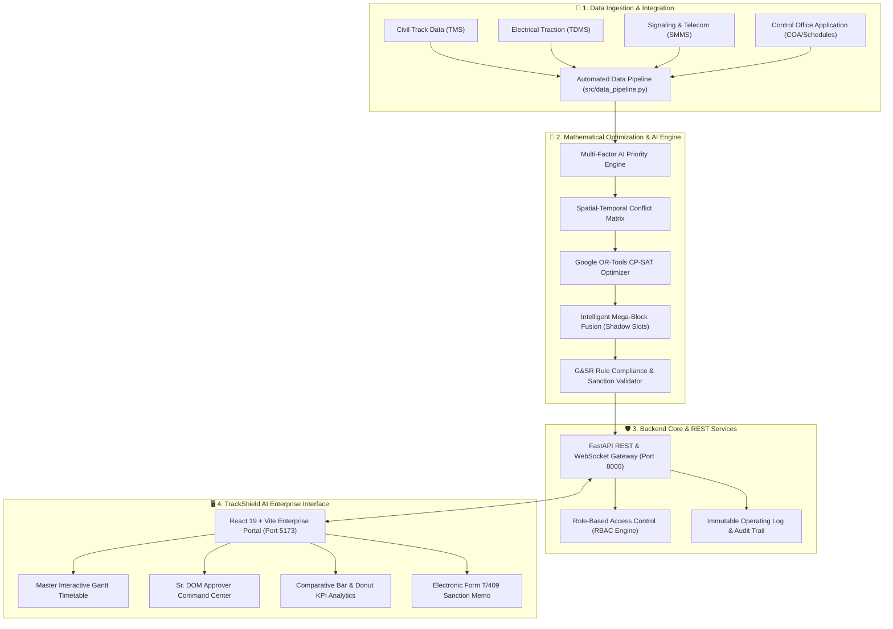

# 🚆 TrackShield AI — Next-Gen Railway Block Planning & Asset Availability Platform

[](https://fastapi.tiangolo.com)
[](https://python.org)
[](https://developers.google.com/optimization)
[](https://react.dev)
[](https://vitejs.dev)
[](https://indianrailways.gov.in)
[](LICENSE)

> **Smart India Hackathon (SIH) 2026 — Problem Statement 26027**  
> **AI-Powered Automatic Block Planning to Maximize Asset Availability for Train Operations on Indian Railways.**

---

## 📌 Executive Summary

**TrackShield AI** is an enterprise-grade artificial intelligence platform developed for the Ministry of Railways, Indian Railways. It addresses the critical operational bottleneck of coordinating corridor maintenance blocks across high-density networks (HDN), the Golden Quadrilateral, and dedicated freight corridors (WDFC/EDFC).

By combining **Google OR-Tools CP-SAT constraint optimization**, multi-departmental block fusion (Civil TMS, Electrical TDMS, Signaling SMMS), and strict **General & Subsidiary Rules (G&SR)** compliance, TrackShield AI delivers:
- 📉 **75% Reduction in Corridor Downtime** via multi-department mega-block fusion.
- ⚡ **62% Faster Block Planning Cycles** (from 4–6 hours of manual telegraphic coordination down to seconds).
- ⏱️ **38.5% Improvement in Section Punctuality & Headway Utilization**.
- 🛡️ **Zero Unscheduled Safety Overlaps** through algorithmic conflict resolution.

---

## 🏛️ System Architecture



---

## ⚡ Key Features

### 1. Multi-Department Mega-Block Fusion
- Intelligently merges overlapping maintenance requisitions from **Civil Engineering (Track/P-Way)**, **Electrical TRD (OHE/Substations)**, and **Signaling & Telecom (Interlocking/Axle Counters)** into single, unified mega-blocks.
- Exploits natural freight train headway shadow windows to schedule maintenance without canceling passenger services.

### 2. Statutory Role-Based Access Control (RBAC)
Strict adherence to Indian Railways Operating Hierarchy:
| Role | Authority Level | Permitted Actions |
| :--- | :--- | :--- |
| **Sr. DOM (Senior Div. Operating Manager)** | 👑 Approver | Statutory sanction, memo issuance, block rejection & revocation |
| **Chief Block Planner** | 🛠️ Planner | Corridor plan generation, CP-SAT optimization, mega-block fusion |
| **P-Way Engineer (AEN / DEN)** | 👷 Civil TMS | Requisition submission, concurrence checklist, view-only sanction |
| **Traction Engineer (DEE / TrD)** | ⚡ Electrical TDMS | OHE power block request, safety clearance, view-only sanction |
| **Signal Engineer (DSTE)** | 📡 Signaling SMMS | Interlocking block request, gear testing, view-only sanction |
| **Section Controller / Station Master** | 👁️ Viewer | Live corridor feed monitoring, real-time train movement tracking |

### 3. Complete Approval & Rejection Lifecycle
- **One-Click Official Sanction:** Generates an electronic Form T/409 with Indian Railways letterhead, DRM endorsement, section details, and speed restriction guidelines.
- **Instant Revoke & Immediate Timetable Deletion:** When a sanction is revoked or rejected by Sr. DOM, it is **instantly deleted from the active schedule** (`scheduled_blocks`), preventing corridor dispatch conflicts.
- **Department Stand-Down Alert:** All participating engineering departments receive an immediate high-priority cancellation notification with the approver's official justification reason.

### 4. Interactive Master Gantt Timetable
- Visual corridor timetable with multi-track elevation (UP/DN lines, loop lines).
- **Time Horizon Controls:** Seamless toggle between Previous Historic Plans, Today's Live Schedule, and Future Projections with customizable time-window sliders.
- Instant visual demarcation of active passenger trains, fused maintenance windows, and speed restriction zones.

### 5. Advanced Operational Analytics
- **Grouped Bar Graph:** Head-to-head comparison of Traditional Manual Planning vs TrackShield AI across 6 critical operational metrics.
- **Corridor Maintenance Allocation Donut Chart:** Interactive task distribution by department (TMS, TDMS, SMMS) and block type (Fused Mega-Blocks vs Standalone vs Freight Headway Slots).

### 6. Enterprise UI Design System
- Modern Indian Railways aesthetic with Tiranga accents, crisp enterprise typography, and light/dark theme toggle.
- Built with high-performance Vanilla CSS variables for maximum speed, consistency, and zero bulky CSS framework overhead.

---

## 📂 Project Structure

```
SIH data/
├── backend/
│   ├── main.py                     # FastAPI REST API, endpoints, RBAC & state engine
│   ├── optimizer.py                # CP-SAT constraint programming logic
│   ├── app/
│   │   ├── services/
│   │   │   ├── run_ai.py           # End-to-end 8-stage AI execution pipeline
│   │   │   ├── priority_engine.py  # Multi-factor asset risk scoring
│   │   │   ├── block_generator.py  # Maintenance block window candidate generator
│   │   │   ├── conflict_engine.py  # Spatial-temporal conflict detection matrix
│   │   │   └── final_validator.py  # G&SR rule compliance verification
│   │   └── utils/                  # Mathematical and corridor helpers
├── frontend/
│   ├── src/
│   │   ├── App.jsx                 # Main application state & tab routing
│   │   ├── components/
│   │   │   ├── ApproverDashboard.jsx # Sr. DOM sanction & revocation command center
│   │   │   ├── MasterGantt.jsx     # Interactive corridor timetable & time slider
│   │   │   ├── KPIDashboard.jsx    # Grouped bar graph & SVG donut pie chart
│   │   │   ├── SanctionModal.jsx   # Electronic Form T/409 printable memo
│   │   │   ├── OperationsDashboard.jsx # Live corridor feed & block overview
│   │   │   ├── DataFeeds.jsx       # Real-time CSV and sensor feed monitor
│   │   │   ├── Navbar.jsx          # Dual-theme header & active role badge
│   │   │   └── LoginModal.jsx      # Preset credential switcher for RBAC testing
│   │   ├── index.css               # Indian Railways enterprise design tokens
│   │   └── main.jsx                # React DOM entry point
│   ├── package.json
│   └── vite.config.js
├── data/
│   ├── raw/                        # Gujarat railway corridor dataset (trains, stations, faults)
│   ├── processed/                  # Normalized corridor tables for optimization
│   └── output/                     # Exported schedule plans and JSON reports
├── src/
│   └── data_pipeline.py            # Automated ETL data cleaning and pipeline
├── tests/                          # Automated Pytest validation test suite
├── AI_LAYER.md                     # Mathematical and algorithmic specification
├── DATA_PIPELINE.md                # Data schema and ingestion documentation
├── requirements.txt                # Python backend dependencies
└── package.json                    # Monorepo task runners and scripts
```

---

## 🚀 Quick Start Guide

### Prerequisites
- **Python 3.11+** installed ([python.org](https://www.python.org/))
- **Node.js 18+** and **npm** installed ([nodejs.org](https://nodejs.org/))

---

### Step 1: Clone the Repository
```bash
git clone https://github.com/ranakeval53-cmd/SIH2026.git
cd SIH2026
```

### Step 2: Set Up & Start Backend
```bash
# Create and activate virtual environment (optional but recommended)
python -m venv venv
# Windows:
venv\Scripts\activate
# Linux/macOS:
source venv/bin/activate

# Install dependencies
pip install -r requirements.txt

# Launch FastAPI server
python -m uvicorn backend.main:app --host 127.0.0.1 --port 8000 --reload
```
*Backend runs at:* `http://127.0.0.1:8000`  
*Interactive Swagger API Docs:* `http://127.0.0.1:8000/docs`

---

### Step 3: Set Up & Start Frontend
Open a new terminal window:
```bash
cd frontend

# Install Node dependencies
npm install

# Start Vite development server
npm run dev
```
*Frontend runs at:* `http://127.0.0.1:5173`

---

## 🔑 Quick Login Presets for Evaluators

When opening `http://127.0.0.1:5173/`, you can use the preset quick-fill buttons on the login modal:

| Persona | Name | Division / Role | Capabilities |
| :--- | :--- | :--- | :--- |
| **Approver (Sr. DOM)** | `sih.approver@ir.gov.in` | Operating Control (Sr. DOM) | Full statutory sanction, rejection, revocation & Form T/409 export |
| **Chief Planner** | `sih.planner@ir.gov.in` | Operating (Block Planning) | CP-SAT optimization, corridor plan generation & block fusion |
| **Civil Track Engineer** | `civil.tms@ir.gov.in` | Engineering (P-Way AEN) | Department concurrence, requisition checklist, view-only sanction |
| **Electrical TRD** | `electrical.trd@ir.gov.in` | Electrical (TRD DEE) | OHE power block clearance, view-only sanction |
| **Signaling S&T** | `signal.snt@ir.gov.in` | S&T (DSTE) | Point machine/interlocking block tracking, view-only sanction |
| **Corridor Controller** | `controller@ir.gov.in` | Section Control | Read-only corridor live monitor & train headway tracking |

---

## 🔌 API Reference Overview

| Method | Endpoint | Description |
| :--- | :--- | :--- |
| `GET` | `/api/kpis` | Operational KPI metrics, downtime saved, and punctuality rate |
| `POST` | `/api/optimizer/plan` | Solves CP-SAT optimization model and returns conflict-free blocks |
| `GET` | `/api/approvals/requests` | Lists all pending, approved, and rejected sanction requests |
| `POST` | `/api/approvals/action` | Approver action endpoint (`APPROVE`, `REJECT`, `REVOKE`, `RESTORE`) |
| `GET` | `/api/approvals/analytics`| Grouped bar graph and donut distribution analytics data |
| `GET` | `/api/tasks` | Raw engineering maintenance requisitions from all departments |
| `GET` | `/api/conflicts` | Spatial-temporal conflict matrix and overlap warnings |
| `GET` | `/api/datasets/status` | Ingestion status of Gujarat railway corridor data feeds |

---

## 🧪 Testing & Validation

Run the automated backend test suite:
```bash
pytest tests/ -v
```

Build the production frontend bundle:
```bash
cd frontend
npm run build
```

---

## 🏆 Smart India Hackathon Team Details

- **Problem Statement ID:** PS 26027
- **Project Title:** TrackShield AI — AI-Powered Railway Block Planning Platform
- **Organization:** Ministry of Railways, Indian Railways
- **Repository:** [github.com/ranakeval53-cmd/SIH2026](https://github.com/ranakeval53-cmd/SIH2026)

---

## 📜 License

This project is licensed under the MIT License — see the [LICENSE](LICENSE) file for details.
